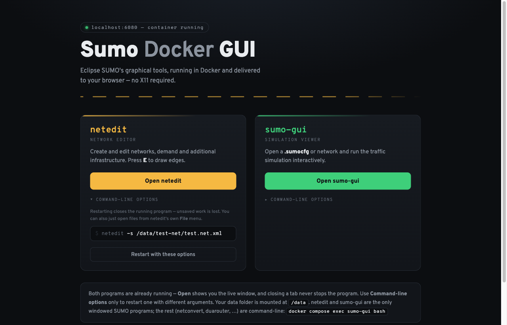
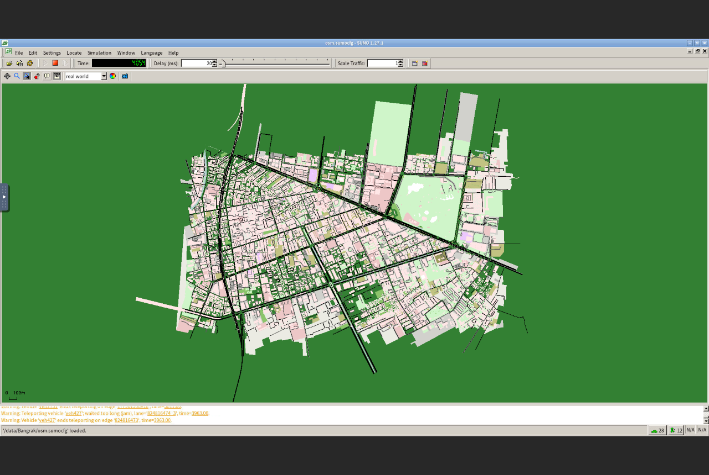

# Sumo Docker GUI

**Run SUMO's graphical tools on macOS — in your browser.**

[Eclipse SUMO](https://eclipse.dev/sumo/) is a free traffic simulation package.
Its two graphical programs — **netedit** (the network editor) and **sumo-gui**
(the simulation viewer) — **no longer work on recent versions of macOS**: the
windows open but show only a grey screen, because macOS broke the graphics
layer (OpenGL in XQuartz) that they depend on
([details](https://github.com/XQuartz/XQuartz/issues/446)). This is not
something you can fix by reinstalling.

This project is the workaround: the two GUI programs run inside a Docker
container and appear **in your web browser**. The container ships a complete
SUMO installation, so this is all you need — installing SUMO on the Mac
itself is optional (see below).





---

## Setup (once)

Only two steps — the container brings its own complete SUMO installation,
so you do **not** need to install SUMO on the Mac first. Allow ~15 minutes.

### Step 1 — Install Docker Desktop

1. Download **Docker Desktop for Mac** (Apple silicon):
   <https://www.docker.com/products/docker-desktop/>
2. Open the downloaded `.dmg`, drag Docker into Applications, and launch it
   once. Wait until the whale icon in the menu bar stops animating.

Docker must be running whenever you use the GUI.

### Step 2 — Get this tool and start it

In Terminal:

```bash
git clone https://github.com/callmeott/sumo-docker-gui.git
cd sumo-docker-gui
cp env.sample .env
mkdir -p ~/Sumo
docker compose up -d --build
```

(No git? Use **Code → Download ZIP** on the GitHub page, unzip it, and `cd`
into the folder instead of the first two lines.)

The first start downloads and builds the container — a few minutes on a
normal connection. Later starts take seconds.

Then open: **<http://localhost:6080>** — you'll see the launch page with
buttons for netedit and sumo-gui. Bookmark it. **Setup done.**

---

## Everyday use

- **Start** (e.g. after a reboot): open Docker Desktop, then in Terminal:
  `cd sumo-docker-gui && docker compose up -d`
- **Open the GUI:** go to <http://localhost:6080>, click **Launch / Restart**
  on the program you want. It opens in a new tab.
- **Stop:** `docker compose stop` (or just quit Docker Desktop).

### Where do my files go?

Your SUMO files live in the **`~/Sumo`** folder on your Mac (created in
step 2; change it by editing `SUMO_DATA` in the `.env` file). Inside
netedit / sumo-gui, that same folder is called **`/data`**:

| On your Mac | Inside the GUI |
| --- | --- |
| `~/Sumo/mynet.net.xml` | `/data/mynet.net.xml` |
| `~/Sumo/bangkok/run.sumocfg` | `/data/bangkok/run.sumocfg` |

Anything you save under `/data` appears in `~/Sumo` — and nothing outside it
is visible to the container.

### The editable command line

Each launch card has a command-line box. Leave it empty to start the program
plain, or add arguments before clicking **Launch / Restart**, e.g.:

- netedit: `-s /data/mynet.net.xml` (open a network)
- sumo-gui: `-c /data/run.sumocfg` (open a simulation configuration)

All options are in the [sumo-gui](https://sumo.dlr.de/docs/sumo-gui.html) and
[netedit](https://sumo.dlr.de/docs/netedit.html) documentation. **Open
window** shows the running program without restarting it.

### Command-line tools (netconvert, duarouter, …)

The rest of SUMO is command-line only. Two ways to use it:

- **Inside the container (nothing extra to install):**

  ```bash
  docker compose exec sumo-gui bash
  # you now have sumo, netconvert, duarouter, ... with your files in /data
  ```

- **Natively on the Mac (optional):** install SUMO from
  <https://sumo.dlr.de/docs/Downloads.php> (under **macOS**, the
  `sumo-<version>.pkg` installer; if macOS refuses to open it, right-click →
  **Open**), then tell your Terminal where it is by pasting this block:

  ```bash
  cat >> ~/.zshrc <<'EOF'
  export SUMO_HOME="/Library/Frameworks/EclipseSUMO.framework/Versions/Current/EclipseSUMO/share/sumo"
  export PATH="$SUMO_HOME/bin:$PATH"
  EOF
  ```

  (If your Terminal uses bash instead of zsh, use `~/.bash_profile` in place
  of `~/.zshrc`.) Open a new Terminal window and check with `sumo --version`.
  The GUI programs still won't open natively — that's what this project is
  for — but all command-line tools will work.

---

## How it works — what is actually running?

Everything lives in one Docker container. Each program gets its own invisible
"virtual screen"; a small chain of helpers streams that screen to a browser
tab and sends your mouse/keyboard back:

```
        YOUR MAC                       │              DOCKER CONTAINER
                                       │
  Browser — launch page                │
  localhost:6080 ───────── HTTP ───────┼──▶ gui-server.py — serves the page; on
                                       │    "Launch/Restart" saves the command
                                       │    line and restarts that program
                                       │
  Browser — netedit tab                │
  localhost:6081 ── WebSocket + token ─┼──▶ websockify ──▶ x11vnc ──▶ screen :1
                                       │    (gatekeeper)    (VNC)        ▲ draws
                                       │                              netedit
  Browser — sumo-gui tab               │
  localhost:6082 ── WebSocket + token ─┼──▶ websockify ──▶ x11vnc ──▶ screen :2
                                       │    (gatekeeper)    (VNC)        ▲ draws
                                       │                              sumo-gui
                                       │
  ~/Sumo folder ◀══════════ shared as /data ══════════▶ files the programs
  (SUMO_DATA)                          │                open and save
```

The pieces, one line each:

| Piece | Role |
| --- | --- |
| **Xvfb** (screens `:1`, `:2`) | An invisible virtual monitor that each program draws on |
| **netedit / sumo-gui** | The actual SUMO programs, drawing on their own virtual monitor; auto-respawn if closed |
| **x11vnc** | Watches a virtual monitor and speaks VNC (screen out, mouse/keyboard in); reachable only inside the container |
| **websockify** | Bridges the browser's WebSocket to x11vnc's VNC — and rejects any connection without the session token |
| **gui-server.py** | The launch page and its small API (save arguments, restart a program, hand out the tokened links) |
| **noVNC** | The JavaScript in the browser tab that turns the VNC stream into pixels you can click on |

So "opening netedit" really means: your browser tab (noVNC) connects through
websockify to x11vnc, which shows you virtual screen `:1`, where netedit is
drawing. The launch page is just a remote control on the side.

## Configuration

All settings live in `.env` (copy of `env.sample`):

| Setting | Default | Meaning |
| --- | --- | --- |
| `SUMO_DATA` | `~/Sumo` | Mac folder that appears as `/data` in the GUI |
| `SCREEN` | `1920x1080` | Virtual screen size (bigger = sharper) |
| `UI_FONT` | `Noto Sans CJK SC` | Application UI font |

After changing `.env`, run `docker compose up -d` again.

## Security

This tool is designed for use on your own Mac only:

- Ports `6080`–`6082` are bound to `127.0.0.1`, so nothing is reachable from
  the network. Don't re-bind them to a public interface — the GUI sessions
  are not designed for shared or remote use.
- Every GUI session is protected by a random per-start token (browsers let
  any website open WebSockets to localhost; without the token such a
  connection is refused).
- The launcher endpoint validates the `Host` and `Origin` headers and
  requires a custom request header, blocking DNS-rebinding and cross-site
  request forgery.
- The container only sees the folder you set as `SUMO_DATA` (as `/data`);
  the rest of your Mac is not visible to it.

## Troubleshooting

| Symptom | Fix |
| --- | --- |
| `Cannot connect to the Docker daemon` | Start Docker Desktop and wait for the whale icon to settle |
| `port is already allocated` | Another app uses 6080/6081/6082 — change the left-hand port numbers in `docker-compose.yml` |
| Browser can't reach `localhost:6080` | `docker compose ps` — if nothing is running, `docker compose up -d` |
| A GUI tab shows black | The program is restarting; wait a few seconds and reload the tab |
| Mounted folder is empty in `/data` | Check `SUMO_DATA` in `.env` points to the right folder, then `docker compose up -d` |

## Notes & limitations

- netedit and sumo-gui are the only windowed SUMO programs; all other tools
  (netconvert, duarouter, the Python tools, …) are command-line — see
  "Command-line tools" above for running them in the container or natively.
- Quitting a program in the GUI just respawns it — use the launch page to
  restart it with different arguments.
- The upstream SUMO image is linux/amd64; on Apple silicon it runs under
  Rosetta emulation. Fine for editing; huge networks may feel sluggish.
- Keyboard: direct layouts (Thai, European, …) work, but SUMO's GUI toolkit
  (FOX 1.6) discards non-Latin characters in text fields — a toolkit
  limitation that exists on native Linux too. IME-composed input
  (Chinese/Japanese/Korean) doesn't work over VNC.

## Credits

[Eclipse SUMO](https://eclipse.dev/sumo/) is developed by the German
Aerospace Center (DLR) and community — see the
[documentation](https://sumo.dlr.de/docs/). This project is an unaffiliated
convenience wrapper around the official
[SUMO Docker image](https://github.com/eclipse-sumo/sumo/pkgs/container/sumo).
